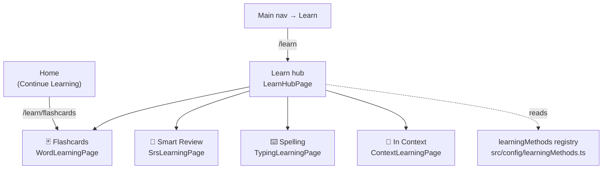
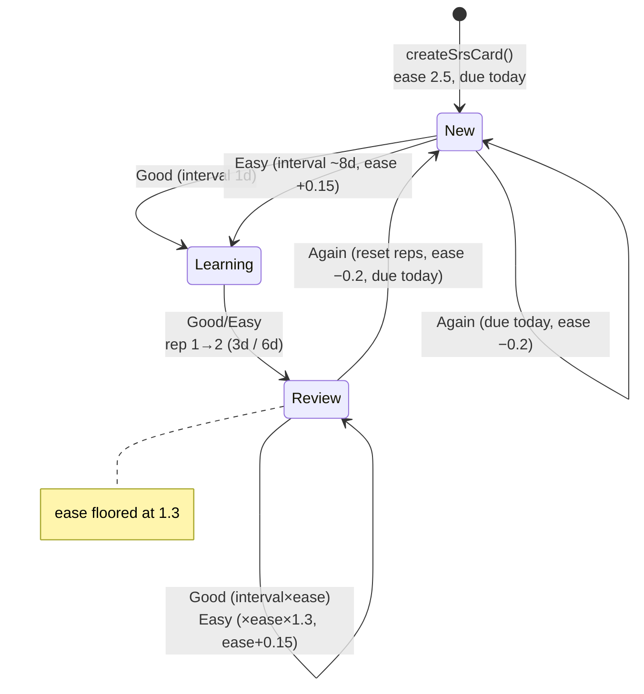
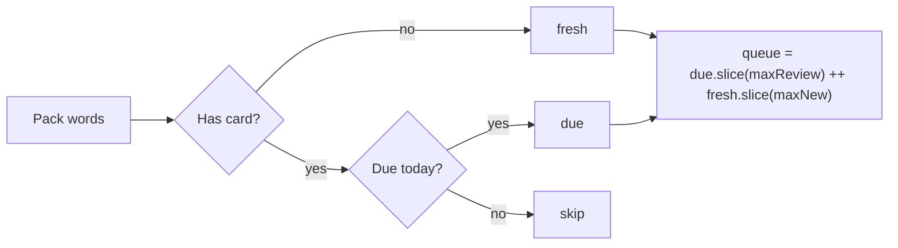
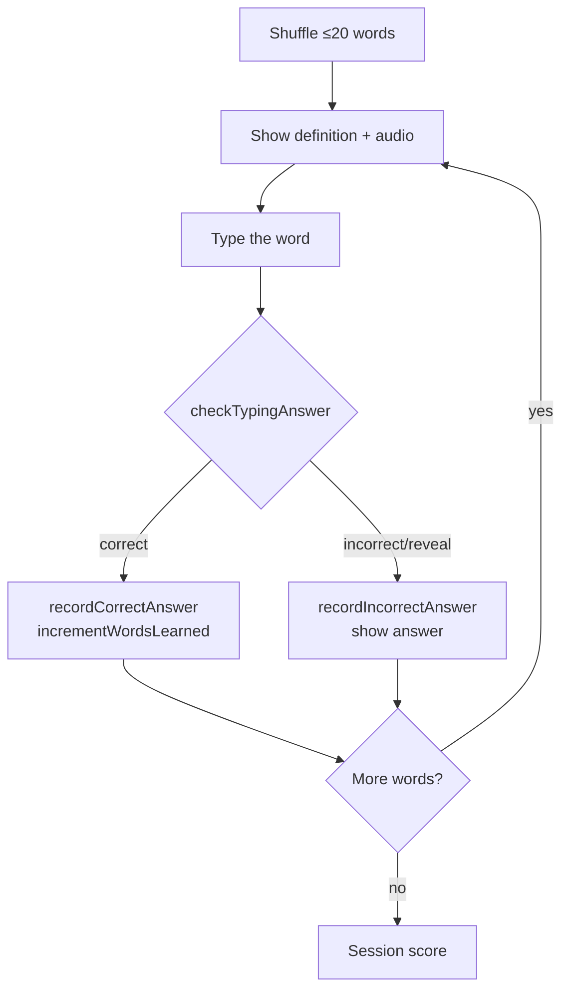
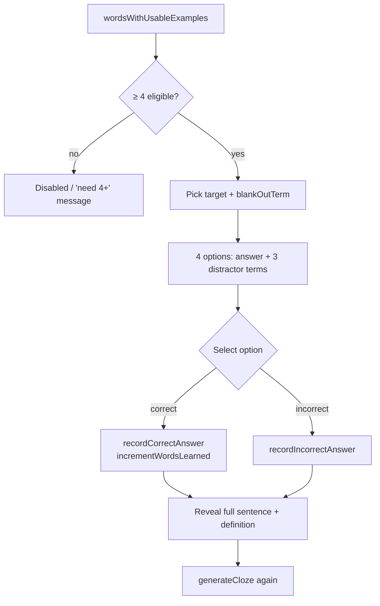

# Learning Methods

KidsTerm lets a learner pick **how** they want to learn new words. All methods
live behind the **Learn hub** at `/learn` and operate on the active language
pack's words. This document describes the architecture, the logic of each
method, and how to add a new one.

## Architecture

The hub renders itself from the **`learningMethods` registry**
(`src/config/learningMethods.ts`) — the single source of truth for the method
id, route, emoji, title/description i18n keys, and the `minWords` gate. Routes
are declared in `src/routes/index.tsx` as children of `/learn`.

Every method shares the same building blocks:

- **Words** come from `useActiveLanguagePack()` (respects the difficulty filter
  in settings). A `?favorites=true` query param restricts to favorited words.
- **Progress** is recorded through `useProgressStore` so streaks, the daily
  goal, and achievements keep working across methods.
- **Audio** uses `useSpeech()`; **text** uses `useTranslation()`.
- **Business logic is extracted into pure functions** under `src/utils/*` and
  the `useSrsStore`, keeping pages thin and the logic unit-testable.

### Adding a new method

1. Append an entry to `learningMethods` in `src/config/learningMethods.ts`.
2. Add the `title`/`desc` (and any method-specific) keys to
   `src/i18n/types.ts` and all locale files (`en`, `tc`, `ja`).
3. Add a `<Route path="learn/<id>" …>` in `src/routes/index.tsx`.
4. Create the page under `src/pages/<Name>LearningPage/`, putting any decision
   logic in a pure util with tests.

The hub will list the new card automatically.

## Method: Flashcards (`/learn/flashcards`)

The original card method. Front shows the term + pronunciation; tap to flip to
the definition + example; swipe right marks a word known
(`incrementWordsLearned`). Unchanged by this feature except its route moved
under the hub. Implemented in `src/pages/WordLearningPage`.

## Method: Smart Review / SRS (`/learn/srs`)

Spaced repetition using a simplified **SM-2** algorithm
(`src/utils/srs.ts`), persisted per word in `useSrsStore`
(`kidsterm-srs-v1`). After revealing the answer the learner self-rates
**Again / Good / Easy**, which reschedules the card.

### Scheduling state machine

### Session queue

`buildSrsQueue(words, cards)` returns **due cards first** (≤ `maxReview`, default
20) followed by **brand-new words** (≤ `maxNew`, default 10):

`getSrsStats()` powers the hub badge (`N to review` / `N new` / `All caught up`).
On each rating the page calls `useSrsStore.rate()`, counts a brand-new card as a
newly-learned word, and records a correct/incorrect answer for accuracy streaks.
Cards rated *Again* simply stay due for the next session (no intra-session
requeue in this version).

## Method: Spelling / Typing (`/learn/typing`)

The learner reads a word's meaning (and can hear the word) and types it.
Matching is forgiving via `checkTypingAnswer()` (`src/utils/answerCheck.ts`):
trim, lowercase, collapse internal whitespace; empty input never counts.

## Method: In Context / Cloze (`/learn/context`)

The learner sees an example sentence with one word blanked out and chooses the
missing word from four options. Generation is `generateCloze()`
(`src/utils/clozeGenerator.ts`), which only uses words whose example sentence
actually contains the term (`wordsWithUsableExamples`); it needs at least
`MIN_CLOZE_WORDS` (4) eligible words, otherwise the hub disables the card.

## Data model & progress, per method

| Method     | `LanguageWord` fields used                 | Progress actions |
|------------|--------------------------------------------|------------------|
| Flashcards | term, pronunciation, definition, examples  | `incrementWordsLearned`, `addTimeSpent` |
| SRS        | term, pronunciation, definition, examples  | `rate` (store) → `incrementWordsLearned`, `recordCorrect/IncorrectAnswer`, `addTimeSpent` |
| Typing     | term, definition, pronunciation            | `recordCorrect/IncorrectAnswer`, `incrementWordsLearned`, `addTimeSpent` |
| Context    | term, definition, examples                 | `recordCorrect/IncorrectAnswer`, `incrementWordsLearned`, `addTimeSpent` |

## Tests

- Pure logic (100% function coverage, gated in `vite.config.ts`):
  `src/utils/srs.test.ts`, `answerCheck.test.ts`, `clozeGenerator.test.ts`,
  `src/store/useSrsStore.test.ts`, `src/config/learningMethods.test.ts`.
- Smoke (render): `src/pages/__smoke__/learnPages.smoke.test.tsx`.
- E2E smoke: `e2e/learn-hub.spec.ts`; flashcard route updates in
  `e2e/word-learning.spec.ts`.

Run `npm run test:coverage` for unit + smoke + the coverage gate, and
`npm run test:e2e` for Playwright.
